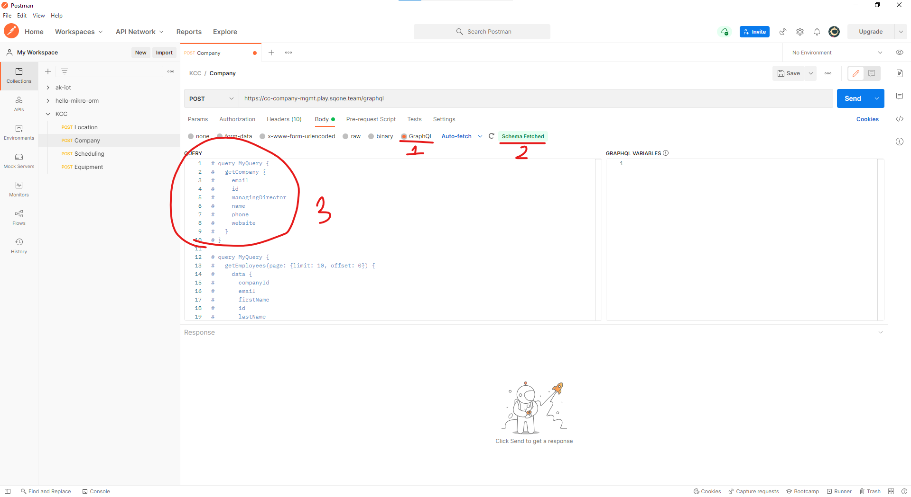

## Amplify Login With Cognito
- Create `.env.play` and `.env.dev`
- `npm install`
- `npm run start-play` to get `access token` for play enviroment
- `npm run start-dev` to get `access token` for dev enviroment

## How to use
1. After run `npm run start-play`, copy the `accessToken.jwtToken`
   
    

2. Open **Postman**, and add the token to the **Authorization** header

3. Body use **GraphQL**, if postman can fetch the schema then auth work
